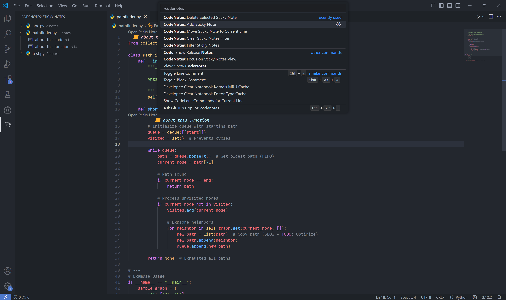
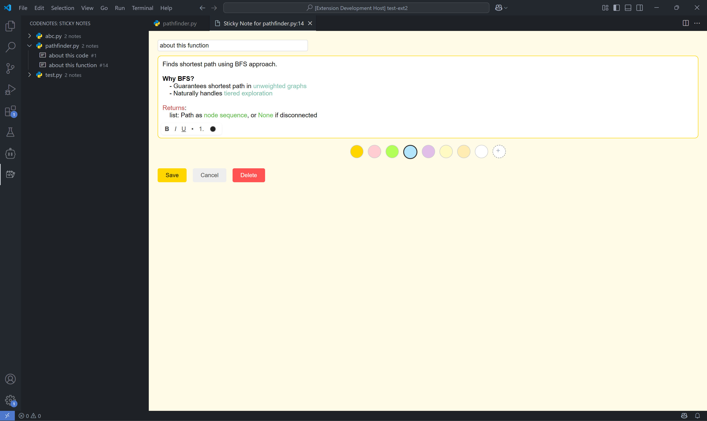

# CodeNotes

Easily add sticky notes to any line of code, color-code them, and manage them via a sidebar. Notes persist across sessions, are highlighted in your editor, and can be searched, filtered, and deleted.

## Features

- **Sticky Notes**: Attach notes to any line of code in any file.
- **Move Notes**: Move sticky notes to a different line.
- **Color Coding**: Choose from a palette of colors or pick any custom color for each note.
- **Sidebar Management**: View, search, filter, and delete notes from the sidebar.
- **Sorting**: Notes in the sidebar are sorted by filename and line number for easy navigation.
- **Highlighting**: Annotated lines are decorated in the editor with your chosen color.
- **Multiline Notes**: Add detailed, multiline notes using a webview UI.
- **Rich Text Formatting**: Use bold, italic, underline, lists, and text color in your notes.
- **Persistent**: Notes are saved in `.vscode/notes.json` and persist across sessions.

## Usage

1. **Add a Sticky Note**
   - Place your cursor on the line where you want to add a sticky note.
   - Use the command palette: `CodeNotes: Add Sticky Note`.
   - Enter your note and select a color from the palette or use the custom color picker.
   - Click **Save**.

2. **View & Manage Notes**
   - Open the **CodeNotes** sidebar to see all notes, sorted by file and line.
   - Click a note to jump to its location.
   - Use the filter box to search notes by content, file, or line number.

3. **Edit or Delete Notes**
   - Open a note (by clicking it in the sidebar) and use the edit or delete buttons in the note webview.
   - Or use the command palette: `CodeNotes: Edit Sticky Note` or `CodeNotes: Delete Selected Sticky Note`.

4. **Move a Sticky Note**
   - Place your cursor on the new line where you want to move the note.
   - Use the command palette: `CodeNotes: Move Sticky Note to Current Line`.
   - The selected note will be moved to the current line in the active editor.

## Screenshots

### Command Palette Actions

### Sticky Note Example

## Changelog

See [CHANGELOG.md](./CHANGELOG.md) for release notes.

## Contributing

Contributions are welcome! For major changes, please open an issue first to discuss what you would like to change before submitting a pull request. For minor fixes or improvements, feel free to submit a pull request directly. You can open issues or pull requests on [GitHub](https://github.com/NainishK/vscode-codenotes).

## License

This project is licensed under the [MIT License](LICENSE).
